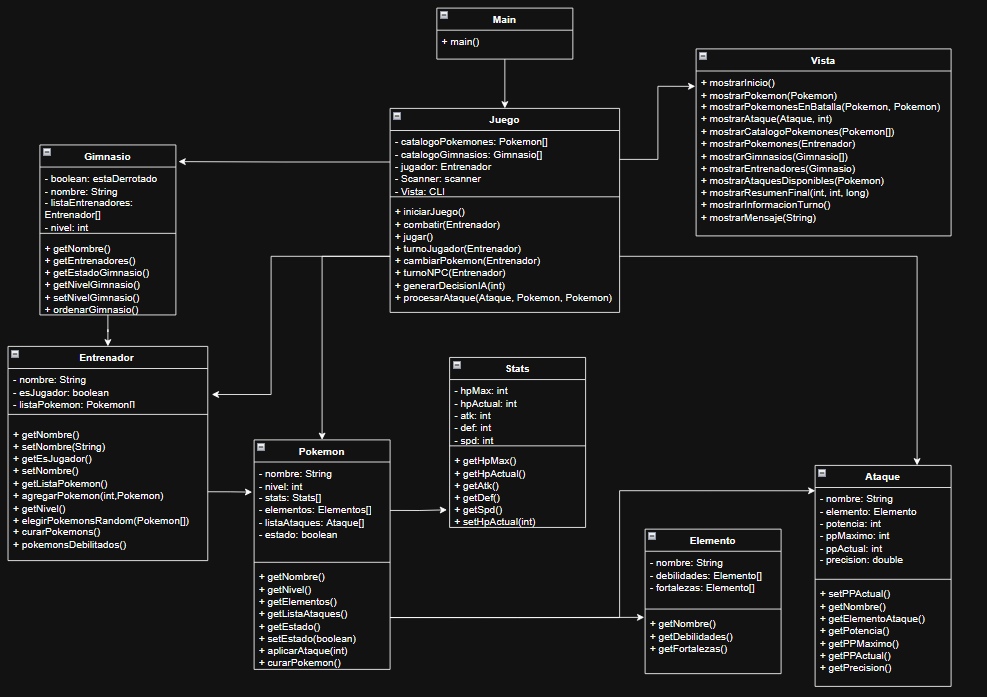
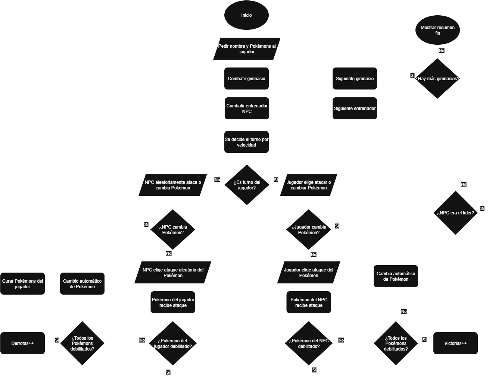

# Simulador de batalla de gimnasio Pokémon
Un simulador de batalla de Pokemones en la línea de comandos creado con programación orientada a objetos.

## Integrantes del proyecto
- Gabriel Torres — B97828
- Ignacio Calero — C31477
- Salet Arce — C5C619
- Fabricio Arias — C5C762

## Diagrama UML

## Diagrama de flujo del programa

## Compilar y ejecutar
Usar el comando `.\play.bat` en el directorio donde se clonó el proyecto.

