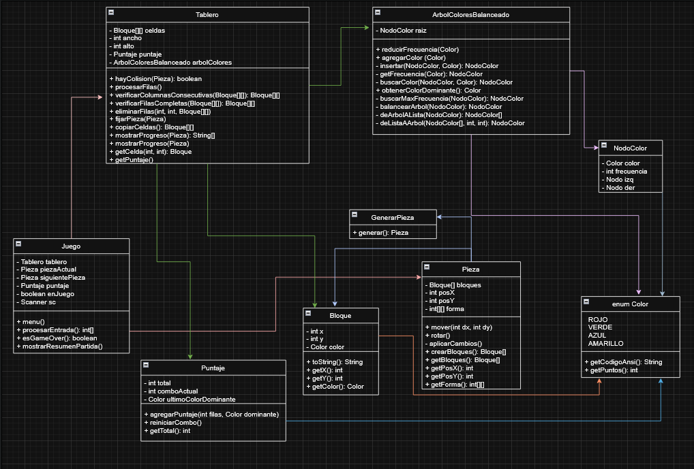

# Tetris en consola utilizando POO
Una implementación del clásico juego Tetris en la línea de comandos utilizando principios de programación orientada a objetos.

## Integrantes del proyecto
- Gabriel Torres — B97828
- Ignacio Calero — C31477
- Salet Arce — C5C619
- Fabricio Arias — C5C762

## Diagrama UML

## Compilar y ejecutar

Usar el comando en el directorio donde se clonó el proyecto.

### En Windows

`.\jugarTetris.bat` 

### En Linux

`bash jugarTetris.sh` 

## Objetivos y alcance

Este proyecto implementa una versión del juego Tetris ejecutada en consola. El propósito principal es aplicar conceptos fundamentales de Programación Orientada a Objetos (POO), incluyendo encapsulación y modularidad junto con el manejo de estructuras de datos como árboles autobalanceados y matrices

El alcance del proyecto incluye:

- **Mecánica de juego completa**: Piezas clásicas de Tetris con rotación de 90° y movimientos.
- **Sistema de colisiones**: Verificación de límites del tablero, bloques fijados y condiciones de Game Over.
- **Limpieza de líneas**: Columnas de 4 bloques del mismo color y filas completas con recursión.
- **Sistema de puntuación**: Puntos basados en colores, frecuencia de aparición mediante árbol autobalanceado y el multiplicador por combos.
- **Interacción con el jugador**: Estado actual del tablero, previsualización de la siguiente pieza y visualización de estadísticas.

## Controles

| Tecla        | Acción        |
| ------------- |:-------------:|
| A      | Mueve la pieza a la izquierda |
| D      | Mueve la pieza a la derecha |
| S      | Mueve la pieza hacia abajo |
| T      | Deja caer la pieza |
| R      | Rotar la pieza |

## Decisiones de diseño

El proyecto implementa una arquitectura OOP con clases especializadas en tareas específicas que ayudan a mantener el código ordenado haciendo más fácil su manipulación y el trabajo en equipo, ejemplo de estas son: `Pieza` (estructuras y movimientos), `Tablero` (colisiones y eliminación de líneas), `Bloque` (unidad básica con posición y color) y `Juego` (coordinador principal del juego). Las piezas utilizan matrices con colores aleatorios, incluyen rotación de 90° que validada los límites del tablero y se controlan mediante entrada de usuario.

El sistema de puntuación combina puntos por color, frecuencia en un árbol autobalanceado que identifica el color dominante y un multiplicador de combos que se incrementa al eliminar líneas consecutivas del mismo color dominante. La eliminación de líneas aplica dos criterios recursivos los cuales son la eliminación de columnas con 4 bloques consecutivos del mismo color, y eliminación de filas completas. La interfaz muestra el estado actual del tablero junto con la previsualización de la siguiente pieza, puntaje en tiempo real y el multiplicador de combos.

## Limitaciones conocidas y trabajo futuro

La principal limitación del proyecto es la interfaz basada en consola, que restringe la experiencia visual y la interacción del usuario, ya que al tener que pausar el juego por cada movimiento hace un poco lenta la experiencia.

Futuras mejoras podrían incluir:
- Implementar una interfaz gráfica para mejorar la experiencia del usuario.
- Implementar la funcionalidad de Ghost piece para previsualizar la posición final de la pieza actual.
- Agregar niveles de dificultad que aumenten la velocidad de caída de las piezas con el tiempo.
- Guardar estadísticas de juego como puntajes más altos.