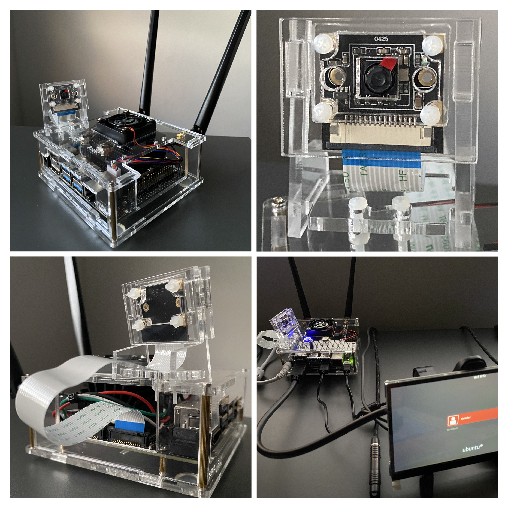

# IMX219 Driver Integration
Bring-up, driver compilation, and camera testing on the **NVIDIA Jetson Nano 4GB Dev Kit** using the **IMX219** sensor.

## Overview
- Review of IMX219 datasheet and schematic connections.
- Validation of I2C communication between Jetson Nano and IMX219.
- Kernel rebuild and IMX219 driver built as external module.
- GStreamer pipeline test for video capture and flip modification.

## Technologies
| Category | Tools / Components |
|-----------|--------------------|
| Hardware | Jetson Nano 4GB, Raspberry Pi Camera v2 |
| OS / Kernel | L4T 32.7.3 (Linux 4.9-tegra) |
| Toolchain | GCC Linaro 7.3.1 aarch64-linux-gnu |
| Debug / Utilities | i2c-tools, Minicom, GStreamer |
| Build | Make, Bash scripts, Cross-compilation |

## Structure
`imx219-driver-integration/`  
├── config/ – Pinmux, I2C, and GPIO settings  
├── docs/ – Notes, logs, and test results  
├── scripts/ – Build and test automation  
├── src/ – Driver and device tree sources  
└── `README.md`

## Tags
`embedded-linux` • `jetson-nano` • `camera-imx219` • `i2c` • `kernel-driver` • `gstreamer`

**Status:** In progress
