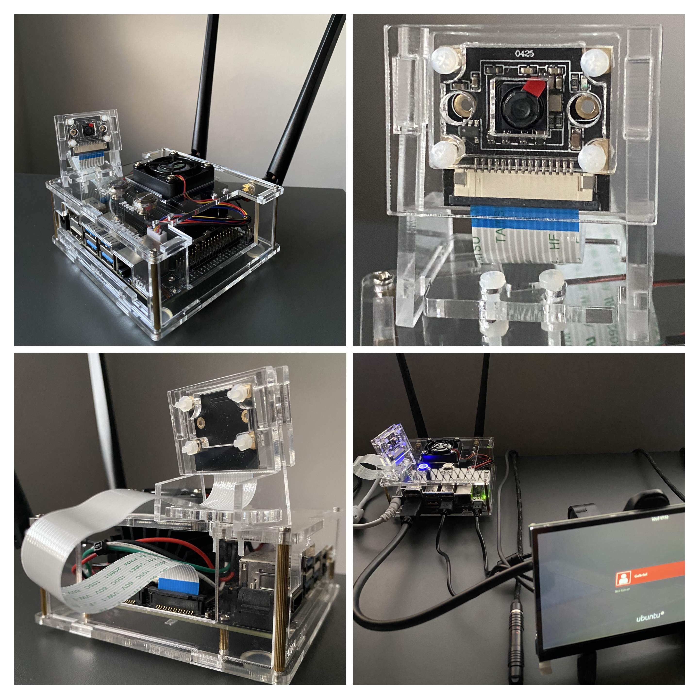
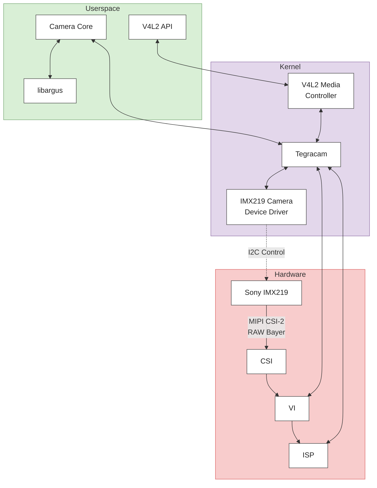

# IMX219 Driver Integration

Development and testing of the Sony IMX219-77 8MP camera on the
NVIDIA Jetson Nano, covering hardware interface validation, I2C
communication, kernel and Device Tree configuration, driver modification,
and camera pipeline validation.



## Overview

This project documents the integration and validation of the Sony IMX219
camera on the NVIDIA Jetson Nano, from hardware interface verification to
driver modification and camera pipeline testing.

The implementation covers I2C communication, kernel and Device Tree
configuration, IMX219 driver analysis, hardware image orientation, and
Bayer phase correction through the NVIDIA camera stack.

## Results

- Validated IMX219 communication over I2C at address `0x10`.
- Built and deployed the kernel, modules, and modified Device Tree.
- Analyzed and modified the NVIDIA IMX219 sensor driver and mode tables.
- Implemented a hardware vertical flip through the IMX219 orientation register.
- Identified the resulting Bayer phase change from `RGGB` to `GBRG`.
- Corrected the Bayer configuration across the sensor modes, restoring
  correct color processing through the Argus/ISP pipeline.

## Documentation

The project is documented progressively. The recommended reading order is:

| Stage | Documentation | Description |
|:---:|---|---|
| 01 | [Hardware Interface](docs/hardware-interface.md) | IMX219 interfaces, camera connector, and Jetson Nano CSI signals. |
| 02 | [I2C Validation](docs/i2c-validation.md) | Verification of sensor communication and I2C address `0x10`. |
| 03 | [Kernel and Device Tree Build](docs/kernel-and-dtb-build.md) | Kernel, modules, and Device Tree compilation and deployment. |
| 04 | [Driver Analysis](docs/driver-analysis.md) | Structure and operation of the NVIDIA IMX219 sensor driver. |
| 05 | [Vertical Flip Modification](docs/vertical-flip-modification.md) | Hardware vertical flip using the IMX219 orientation register. |
| 06 | [Bayer Pattern Correction](docs/bayer-pattern-correction.md) | Investigation and correction of the Bayer phase after the hardware flip. |

Each stage builds on the previous one, progressing from hardware validation
to modifications of the sensor driver and camera processing pipeline.

## Camera Software Architecture

The IMX219 integration spans the hardware, Linux kernel, and userspace
camera stack. The diagram below summarizes the main components involved
in sensor control and image acquisition.


```mermaid
flowchart TB

    subgraph USERSPACE["Userspace"]
        direction LR
        U1["V4L2 API"]
        U2["Camera Core"]
        U3["libargus"]
    end

    subgraph KERNEL["Kernel"]
        direction LR
        K1["V4L2 Media<br/>Controller"]
        K2["Tegracam"]
        K3["IMX219 Camera<br/>Device Driver"]
    end

    subgraph HARDWARE["Hardware"]
        direction LR
        H1["Sony IMX219"]
        H2["CSI"]
        H3["VI"]
        H4["ISP"]
    end

    %% Userspace
    U2 <--> U3

    %% Userspace ↔ Kernel
    U1 <--> K1
    U2 <--> K2

    %% Kernel
    K1 <--> K2
    K2 <--> K3

    %% Hardware data path
    H1 -->|"MIPI CSI-2<br/>RAW Bayer"| H2
    H2 --> H3
    H3 --> H4

    %% Control / framework
    K3 -.->|"I2C Control"| H1
    K2 <--> H3
    K2 <--> H4

    %% Layer colors
    style HARDWARE fill:#f8cccc,stroke:#d66
    style KERNEL fill:#e3d7eb,stroke:#9273a8
    style USERSPACE fill:#d9efd6,stroke:#78a875

    %% Components
    classDef component fill:#fff,stroke:#444,color:#222
    class U1,U2,U3,K1,K2,K3,H1,H2,H3,H4 component
```

The sensor is configured through I2C, while image data is transmitted
as RAW Bayer data over MIPI CSI-2. The Jetson camera stack then exposes
the sensor through V4L2 and NVIDIA's Camera Core/Argus infrastructure.

## Technologies

| Category | Tools / Components |
|---|---|
| Hardware | NVIDIA Jetson Nano 4GB, Raspberry Pi Camera Module 2 (Sony IMX219) |
| OS / Kernel | NVIDIA L4T R32.7.6, Linux 4.9-tegra |
| Toolchain | GCC Linaro, `aarch64-linux-gnu` |
| Camera Stack | V4L2, Tegracam, Argus, GStreamer |
| Interfaces | I2C, MIPI CSI-2 |
| Debug / Utilities | i2c-tools, media-ctl, v4l2-ctl, Minicom |
| Build | Make, Bash, Cross-compilation |

## Project Structure

```text
imx219-driver-integration/
├── device-tree/
│   ├── include/
│   │   └── tegra210-camera-rbpcv2-dual-imx219.dtsi
│   └── src/
│       └── tegra210-p3448-0000-p3449-0000-b00.dts
│
├── docs/
│   ├── images/
│   ├── videos/
│   ├── hardware-interface.md
│   ├── i2c-validation.md
│   ├── kernel-and-dtb-build.md
│   ├── driver-analysis.md
│   ├── vertical-flip-modification.md
│   ├── bayer-pattern-correction.md
│   └── references.md
│
├── driver/
│   ├── include/
│   │   └── imx219_mode_tbls.h
│   └── src/
│       └── imx219.c
│
├── hardware/
│   └── schematics/
│       └── camera-module-2-schematics.pdf
│
├── scripts/
│   ├── build.sh
│   ├── camera-gpio.sh
│   └── capture-video.sh
│
└── README.md
```
