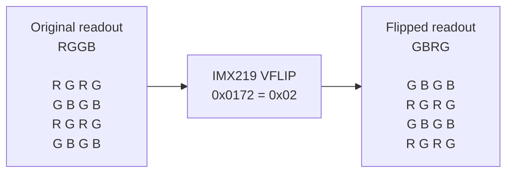
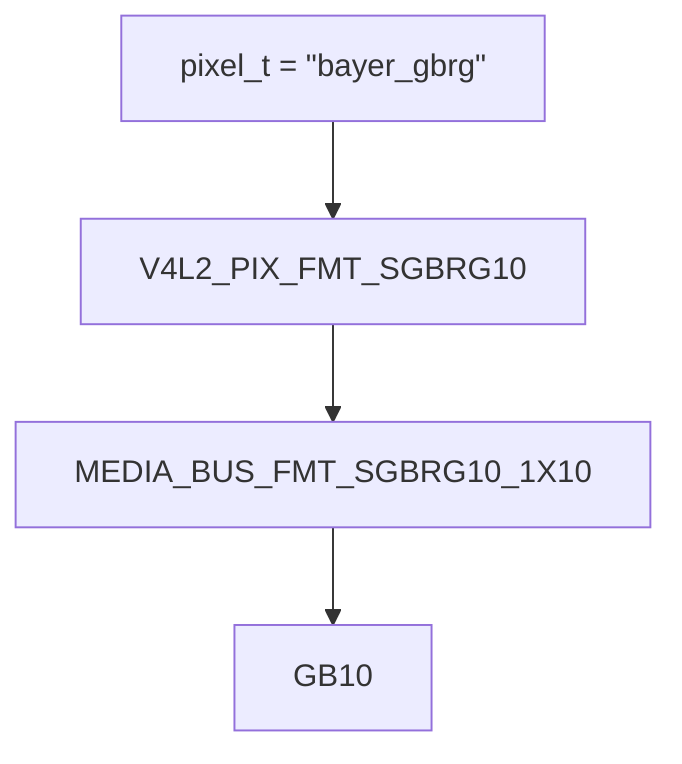
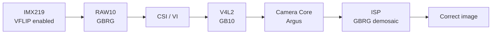

# IMX219 Bayer Phase Correction

## Problem

As it was reviewed in the [vertical flip modification](vertical-flip-modification) documentation, a hardware vertical flip was added to the Sony IMX219 camera on a Jetson
Nano B01 running L4T R32.7.6:

``` c
{0x0172, 0x02}, /* Vertical flip */
```

The image orientation was corrected, but the output from
`nvarguscamerasrc` became strongly magenta.

The goal was to keep the flip at sensor level while restoring correct
color processing through NVIDIA Argus/ISP.

------------------------------------------------------------------------

## Bayer Phase Change


The IMX219 originally exposes an `RGGB` Bayer pattern. Enabling the
sensor's vertical flip changes the spatial arrangement of the Bayer
samples:




Therefore, the Device Tree must describe the Bayer phase produced by
the modified sensor readout:

```dts
/* Before */
pixel_t = "bayer_rggb";

/* After */
pixel_t = "bayer_gbrg";
```

If the flipped GBRG data is still interpreted as RGGB, the color
samples are assigned to the wrong positions during demosaicing,
producing the magenta output.


------------------------------------------------------------------------

### V4L2 correctly recognized GBRG

After changing only `mode3` to:

``` dts
pixel_t = "bayer_gbrg";
```

V4L2 reported:

``` text
Pixel Format : 'GB10'
```

and `media-ctl -p` exposed:

``` text
SGBRG10_1X10
```

This showed that the kernel/V4L2 path correctly propagated the Bayer
phase change.

The relevant format propagation is:



------------------------------------------------------------------------

### Argus still failed

With only `mode3` configured as GBRG, `nvargus_nvraw` failed and
`nvargus-daemon` reported:

``` text
SCF: Error NotSupported:
Output buffer format not supported:
1640x1232 Pitch BayerS16RGGB
```

This indicated that the problem was no longer in the basic V4L2 format
configuration, but in the Camera Core / Argus / ISP path.

For comparison, restoring `pixel_t = "bayer_rggb"` allowed
`nvargus_nvraw` to capture successfully. Its metadata contained:

``` text
base.bayer = RGGB;
```

At that point the sensor was still physically flipped, so the
configuration was inconsistent:

``` text
Physical sensor output : GBRG
Argus metadata         : RGGB
```

------------------------------------------------------------------------

## Key Finding

NVIDIA's Jetson Linux Driver Package R32.7.6 Release Notes, issue
`2583989`, describes a related ISP limitation on Jetson AGX Xavier
with an IMX290 sensor: when sensor modes use different pixel phases, the
ISP considers the pixel phase of the `first sensor mode` for the
remaining modes.

This is not documentation of the exact Jetson Nano IMX219 behavior.
However, it provided the clue for the next experiment.


| Initial configuration | Final test |
| :--- | :--- |
| mode0  RGGB | mode0  GBRG |
| mode1  RGGB | mode1  GBRG |
| mode2  RGGB | mode2  GBRG |
| mode3  GBRG | mode3  GBRG |
| mode4  RGGB | mode4  GBRG |
| mode5  RGGB | mode5  GBRG |


Changing every IMX219 sensor mode in the tegra210-camera-rbpcv2-dual-imx219.dtsi file to GBRG resolved the problem.

------------------------------------------------------------------------

## Final Fix

The hardware flip remains enabled:

``` c
{0x0172, 0x02}, /* Vertical flip */
```

and every IMX219 mode in the Device Tree uses:

``` dts
pixel_t = "bayer_gbrg";
```

The resulting processing chain is:



After rebuilding the Device Tree and rebooting:

-   Hardware vertical flip remained active.
-   V4L2 reported `GB10`.
-   The media bus reported `SGBRG10_1X10`.
-   Argus capture worked.
-   `nvarguscamerasrc` produced correct colors.

------------------------------------------------------------------------

## Verification

``` bash
# Check V4L2 format
v4l2-ctl -d /dev/video0 --list-formats-ext

# Check media-bus format
media-ctl -p

# List Argus sensor modes
nvargus_nvraw --lps

# Capture mode3 through Argus
nvargus_nvraw --c 0 --mode 3 --file /home/gabriel/test --format "raw"
```

For Argus debugging:

``` bash
sudo service nvargus-daemon stop
sudo /usr/sbin/nvargus-daemon
```

Restore the service afterwards:

``` bash
sudo service nvargus-daemon start
```

------------------------------------------------------------------------

### Before and After

The following captures compare the camera output before and after correcting the Bayer phase configuration used by the camera pipeline.

| Before correcting the Bayer phase  | After correcting the Bayer phase  |
:---: | :---:|
| <video src="https://github.com/user-attachments/assets/b8ac68e7-09c5-4df9-8342-b68f3e147613"></video> | <video src="https://github.com/user-attachments/assets/8a87e6fc-12e8-49b6-8a5b-9a17fe8e251c"></video> |

After configuring the IMX219 sensor modes consistently as `bayer_gbrg`, the Argus/ISP pipeline processed the Bayer data correctly, restoring the expected colors while preserving the hardware vertical flip.

------------------------------------------------------------------------


## Summary

The camera was tested primarily with mode3: 1640x1232 @ 30 FPS.

| Configuration | V4L2 | Argus / ISP | Result |
| :--- | :--- | :--- | :--- |
| VFLIP + all modes RGGB | RG10 | RGGB | Magenta image |
| VFLIP + only mode3 GBRG | GB10 | Capture failure | SCF error |
| VFLIP + all modes GBRG | GB10 | Works | Correct colors |


The IMX219 hardware vertical flip changed more than the visual
orientation of the image, it changed the effective Bayer phase from
RGGB to GBRG. Updating the active mode to `bayer_gbrg` was sufficient for V4L2, but
not for the Argus/ISP path on this configuration. The decisive result
was that making the Bayer phase consistent across all IMX219 sensor
modes allowed both V4L2 and Argus/ISP to process the flipped sensor
data correctly.

------------------------------------------------------------------------

## References

* [NVIDIA - Jetson Linux Driver Package R32.7.6 Release Notes,
    Issue 2583989](https://docs.nvidia.com/jetson/archives/l4t-archived/l4t-3276/pdf/Jetson_Linux_Release_Notes_R32.7.6_GA.pdf)


* [NVIDIA - Jetson Linux Driver Package R32.7.6 Developer Guide:
    Camera Architecture](https://docs.nvidia.com/jetson/archives/l4t-archived/l4t-3276/Tegra%20Linux%20Driver%20Package%20Development%20Guide/jetson_xavier_camera_soft_archi.html)

* [NVIDIA - Jetson Linux Driver Package R32.7.6 Developer Guide:
    Sensor Software Driver Programming](https://docs.nvidia.com/jetson/archives/l4t-archived/l4t-3276/Tegra%20Linux%20Driver%20Package%20Development%20Guide/camera_sensor_prog.48.1.html)
