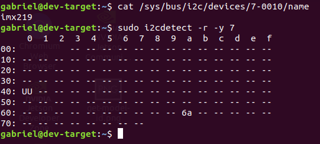
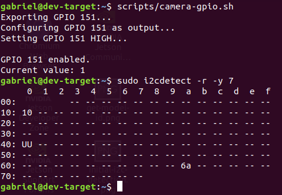
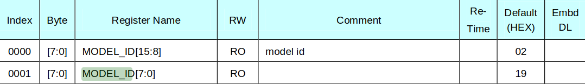
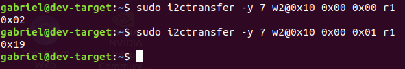

# I2C Validation – IMX219 Camera on Jetson Nano

## Objective

The purpose of this stage is to validate low-level communication between the NVIDIA Jetson Nano and the Sony IMX219 camera sensor using the I2C bus. This is necessary as the camera driver relies on I2C access to configure the sensor before any video data can be streamed over MIPI CSI-2.

---

## Hardware Setup

* NVIDIA Jetson Nano Developer Kit
* Raspberry Pi Camera Module v2 (Sony IMX219)
* 15-pin FFC camera cable

Special care was taken to correctly orient the FFC cable to avoid power or signal shorts. The camera was connected with the Jetson Nano powered off.

---

## Expected I2C Bus and Slave Address

Based on the Jetson Nano Camera Design Guide and the IMX219 datasheet:

* **Expected I2C bus:** Camera I2C bus routed through the CSI connector
* **IMX219 slave address:** `0x10` (7-bit address)

The camera should appear on the I2C bus once it is powered and released from reset.

---

## Initial I2C Scan

The following command was used to scan the expected I2C bus:

```bash
sudo i2cdetect -r -y <bus_number>
```

### Initial Result

* The IMX219 did not appear at address `0x10`
* The bus scan returned no responsive device at the expected address

This indicated that the sensor was either not powered, held in reset, or not yet enabled by a control GPIO.



---

## Why the Camera May Not Appear on I2C

Reviewing the Raspberry Pi Camera Module v2 schematic revealed that:

* The IMX219 requires an **enable/reset GPIO** to be asserted
* Power rails alone are insufficient to activate the sensor

On the Jetson Nano, this GPIO must be configured and driven high before I2C communication becomes possible.

---

## Identifying the Camera GPIO (Pinmux)

The NVIDIA Pinmux configuration files were reviewed to identify the GPIO associated with the camera enable signal.

* **Pinmux label:** `CAM0_PWDN`

The exact label depends on BSP version and is used internally by the kernel and must be translated into a Linux GPIO number.

---

## Calculating the GPIO Number

The file `tegra-gpio.h` from the Jetson kernel sources provides the formula to convert a GPIO label into a numeric GPIO identifier.

```c
#define TEGRA_GPIO_PORT_S 18

#define TEGRA_GPIO(port, offset) \
        ((TEGRA_GPIO_PORT_##port * 8) + offset)
```

| Jetson Nano Signal Name | GPIO        |
| ----------------------- | ----------- |
| CAM0_PWDN               | GPIO3_PS.07 |

Using the port and offset information defined in the Pinmux configuration:

```text
(18 × 8) + 7 = 151
```

Therefore, the camera GPIO used during validation was **GPIO 151**.

---

## Enabling the Camera via GPIO

Once the GPIO number was known, the following sequence was executed:

```bash
sudo su

echo 151 > /sys/class/gpio/export
echo out > /sys/class/gpio/gpio151/direction
echo 1 > /sys/class/gpio/gpio151/value

exit
```

This sequence:

* Exports the GPIO
* Configures it as an output
* Drives it high to release the camera from reset

Note: this sequence of commands is already implemented in the script `camera-gpio.sh`.

---

## I2C Scan After GPIO Enable

After enabling the camera, the I2C scan command was executed again:

```bash
sudo i2cdetect -r -y <bus_number>
```

### Result

* The IMX219 appeared at address **`0x10`**
* Successful acknowledgment confirmed proper power and control sequencing

This validated that the camera sensor was correctly connected and responsive on the I2C bus.



---

## Reading the IMX219 Model ID

The IMX219 datasheet defines the **MODEL_ID** as a 16-bit value stored in two consecutive registers:

```text
0x02 0x19 -> 0x0219
```



The registers were read directly from user space using `i2ctransfer`:

```bash
sudo i2ctransfer -y <bus_number> w2@0x10 0x00 0x00 r1
sudo i2ctransfer -y <bus_number> w2@0x10 0x00 0x01 r1
```

The expected results are:

```text
0x02
0x19
```




This matches the IMX219 chip ID used by the Linux driver.

---

## Summary

* Initial I2C scan failed because the camera enable GPIO was not asserted
* GPIO 151 was configured and driven high
* The IMX219 then appeared at I2C address `0x10`
* Registers `0x0000` and `0x0001` were read using `i2ctransfer`
* The returned values `0x02` and `0x19` identify the sensor as IMX219 (`0x0219`)

This step validates the electrical connection, power sequencing, I2C communication, and sensor identification required for successful driver operation.

---

## References

* [Sony IMX219 Datasheet](https://www.opensourceinstruments.com/Electronics/Data/IMX219PQ.pdf)
* [Raspberry Pi Camera Module v2 Schematic](https://datasheets.raspberrypi.com/camera/camera-module-2-schematics.pdf)
* [NVIDIA Jetson Nano and Jetson Xavier NX Camera Design Guide](https://developer.nvidia.com/embedded/downloads#?search=NVIDIA%20Jetson%20Nano%20and%20Jetson%20Xavier%20NX%20Camera%20Design%20Guide)
* [Jetson Nano Pinmux](https://developer.nvidia.com/embedded/downloads#?search=jetson%20nano%20pinmux)  
* NVIDIA Jetson Linux Kernel Sources
