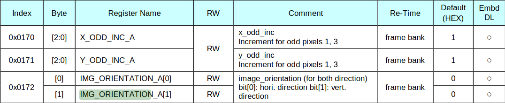

# Vertical Image Flip Modification – IMX219 Driver

## Objective

This section documents the modification of the Sony IMX219 camera driver to perform a vertical image flip for the `1640x1232 @ 30 FPS` capture mode on the NVIDIA Jetson Nano.

The goal is to demonstrate low-level customization of sensor behavior by modifying its register configuration and validating the result through video capture.

---

## Relevant Source File

### `imx219_mode_tbls.h`

The IMX219 driver uses mode-specific register tables to configure the sensor.

The `1640x1232 @ 30 FPS` mode is defined in:

```c
static imx219_reg imx219_mode_1640x1232_30fps[] = {
    ...
};
```

---

## Flip Control Register

According to the IMX219 datasheet, image orientation is controlled by register `0x0172` (`IMG_ORIENTATION_A`).



The relevant bits are:

* Bit 0: horizontal mirror
* Bit 1: vertical flip

Therefore, enabling only the vertical flip requires:

```text
0x0172 = 0x02
```

---

## Implementing the Vertical Flip

The following register entry was added to the `1640x1232 @ 30 FPS` mode:

```c
{0x0170, 0x01},
{0x0171, 0x01},
{0x0172, 0x02}, /* Vertical flip */
{0x0174, 0x01},
{0x0175, 0x01},
```

The remaining mode configuration was left unchanged.

---

## Rebuilding and Validation

After modifying the register table, the IMX219 kernel module was recompiled and deployed to the Jetson Nano.

The modified driver was loaded and the camera was tested using the `1640x1232 @ 30 FPS` GStreamer capture pipeline.

### Before and After

The following captures show the camera output before and after applying the vertical flip register modification.

| Before enabling the hardware vertical flip  | After enabling the hardware vertical flip  |
:---: | :---:|
| <video src="https://github.com/user-attachments/assets/48c84c04-c3d3-485a-8778-854162a84efc"></video> | <video src="https://github.com/user-attachments/assets/b8ac68e7-09c5-4df9-8342-b68f3e147613"></video> |

The resulting video exhibited a vertical flip relative to the original orientation, confirming that the register-level modification was applied successfully.

---

## Bayer Pattern Observation

Although the image orientation was correctly flipped, the resulting image exhibited a strong purple color cast.

The observation suggests that the vertical transformation changes the effective Bayer pattern orientation, while the subsequent image processing continues to interpret the data using the original Bayer arrangement.

This issue is investigated separately in the [bayer pattern correction](bayer-pattern-correction) documentation.

---

## Summary

* IMX219 image orientation is controlled by register 0x0172.
* Bit 1 enables vertical flipping.
* 0x0172 = 0x02 was added to the 1640x1232 @ 30 FPS mode.
* The modification successfully flipped the image vertically.
* A change in color reproduction was observed after the flip, leading to a separate investigation of the Bayer pattern.

---

## References

* [Sony IMX219 Datasheet](https://www.opensourceinstruments.com/Electronics/Data/IMX219PQ.pdf)
* [GStreamer Documentation](https://gstreamer.freedesktop.org/documentation/)
