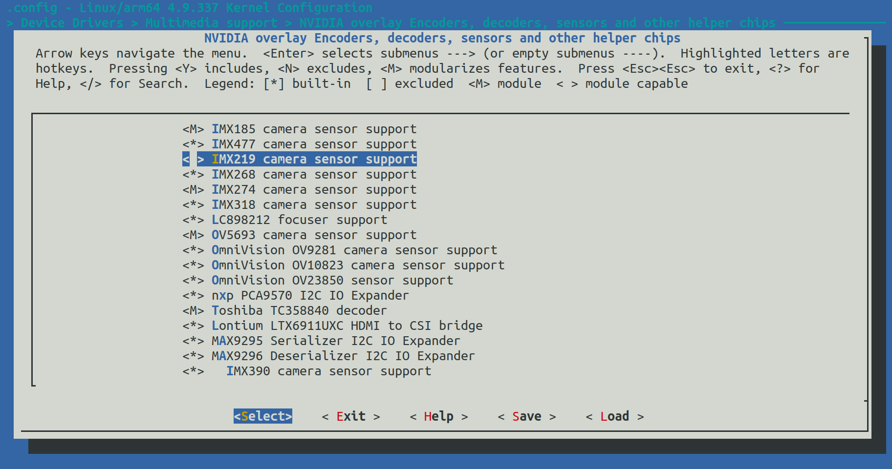
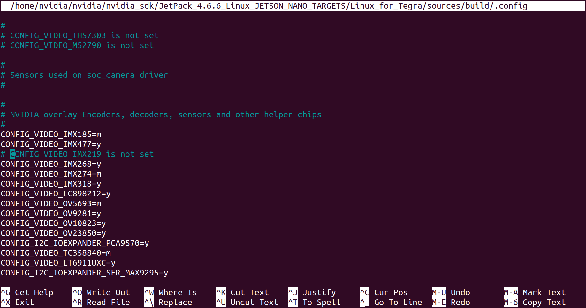
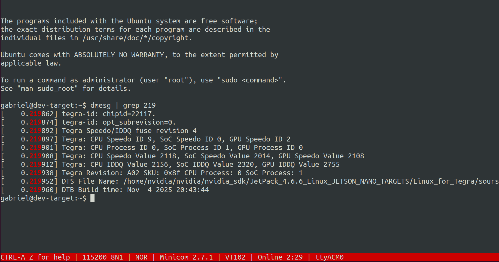

# Jetson Nano — Build, Flash, and Validation (SDK Manager + Cross-Compile)

Reproducible bring‑up and kernel rebuild for NVIDIA Jetson Nano 4GB using SDK Manager in Docker, cross‑compilation with Linaro GCC, UART debugging. Procedures and results in this README are presented as checkpoints.

## Table of Contents
- Overview
- Prerequisites
- Checkpoint 1 — Flash OS with SDK Manager
- Checkpoint 2 — First UART Boot and Kernel Version
- Checkpoint 3 — Build Kernel, Modules, and DTBs
- Checkpoint 4 — Flash the Built Kernel and Re‑Validate
- Checkpoint 5 — Device Tree Name and Kernel Build Time
- Checkpoint 6 — IMX219 Driver Fails to Initialize
- Checkpoint 7 — Disable IMX219 and Rebuild
- Checkpoint 8 — Confirm the Disabling of the IMX219

## Overview
This project documents an end‑to‑end workflow: flashing Jetson OS via SDK Manager, cross‑compiling Linux 4.9‑tegra with Linaro GCC, installing modules and device trees, validating on UART and demonstrating configuration control by excluding the IMX219 camera driver.

## Prerequisites
- Host with Docker and NVIDIA SDK Manager CLI access.
- Linaro GCC 7.3.1 aarch64-linux-gnu in PATH as CROSS_COMPILE.
- USB‑UART connection (115200 8N1) and a terminal tool (e.g., minicom).

---

## Checkpoint 1 — Flash OS with SDK Manager

### Goal
Flash the Jetson Nano from a containerized SDK Manager and confirm a successful installation summary.

### Commands

Start container with USB passthrough.

`.scripts/docker-run-sdkmanager.sh`

Install JetPack/L4T and flash.

`.scripts/flash-sdk.sh`

### Results
- CLI summary shows “INSTALLATION COMPLETED SUCCESSFULLY.”  
  
- GUI panel shows host/target components installed and final success.  
  

### Notes
Keep the board in recovery during the entire flashing process and do not disconnect power or USB.

---

## Checkpoint 2 — First UART Boot and Kernel Version

### Goal
Open a serial console at 115200‑8N1 and verify kernel version at first boot.

### Commands

Run in the development host container.

`./config/serial-setup.sh`

### Results

- Serial login on first boot with uname showing 4.9.337‑tegra (aarch64).  
  

### Notes
Ensure no hardware/software flow control is enabled in the terminal settings.

---

## Checkpoint 3 — Build Kernel, Modules, and DTBs

### Goal
Cross‑compile Image, modules, and DTBs using Linaro GCC with an out‑of‑tree build directory.

### Commands

Run in the development host container.

`./config/env-setup.sh`

`./scripts/build-kernel.sh`

### Results

This step prepares artifacts for Checkpoint 4; see later sections for the runtime validation screenshots. However, you should see a similiar log as `docs/kernel-build.log`.

### Notes
Use dedicated build and modules output folders to keep sources clean and reproducible.

Make sure you have installed the arithmetic language interpreter `bc`.

---

## Checkpoint 4 — Flash the Built Kernel and Re‑Validate

### Goal
Deploy the newly built Image/DTBs to the L4T directories and flash to the board.

### Commands

Run in the development host container with the board in recovery mode.

`./scripts/backup-and-flash-built.sh`

### Results

After running the flash script you should see a similiar log as `docs/flash-built.log`.

- Kernel built is running after flash.

### Notes
If uname does not change as expected, re‑check that Image/DTBs were copied into $L4T/kernel and reflashed.

---

## Checkpoint 5 — Device Tree Name and Kernel Build Time

### Goal
Record the active DTB file name and the kernel build timestamp for traceability.

### Commands

Run in the development target.

`./scripts/get-jetson-info.sh`

### Results
- DTB file name and kernel build time visible in the console capture.  
  

### Notes
Keep these values in release notes or a changelog for future comparisons.

---

## Checkpoint 6 — IMX219 driver fails to initialize

### Goal 

Fix IMX219 driver initialization since it attempts to detect a camera sensor at I2C address 0x10 on bus 7, but the communication fails with error -121 (EREMOTEIO).

### Commands

Capture baseline kernel messages related to the IMX219 sensor.

`dmesg | grep 219`

## Results
- Log shows IMX219 probe attempts and I2C read probe errors while the driver is enabled.  
  

### Notes

The presence of these lines confirms that the driver is compiled and tested during boot. 

To prevent communication errors, the driver can be excluded when building the kernel if it is not needed.

---

## Checkpoint 7 — Disable IMX219 and Rebuild

### Goal
Exclude the IMX219 camera driver via menuconfig, rebuild, and flash the updated kernel/DTBs.

### Commands

Run in the development host container `$L4T/sources/` to open kernel configuration UI.

`make -C kernel/kernel-4.9/ ARCH=arm64 O=$TEGRA_KERNEL_OUT menuconfig`

**Navigate:** Device Drivers ---> Multimedia support ---> NVIDIA overlay Encoders, decoders, sensors and other helper chips

Set `IMX219 camera sensor support` to < > (not set).

Rebuild Image/modules/DTBs and re‑flash as in Checkpoints 3 and 4.

### Results
- Menu entry highlighting the IMX219 option before saving.  
  
- .config reflects the change with “CONFIG_VIDEO_IMX219 is not set.”  
  

### Notes
When re-doing Checkpoint 3 procedures do not run the tegra_defconfig make since it will overwrite the .config changes. In order to avoid this, comment that line in `/scripts/build-kernel.sh`.

---

## Checkpoint 8 — Confirm the Disabling of the IMX219

### Goal
Confirm the IMX219 driver no longer appears in kernel logs after the rebuild and flash.

### Commands
Capture baseline kernel messages related to the IMX219 sensor.

`dmesg | grep 219`

### Results
- Log no longer shows IMX219 entries after excluding the driver.  
  

### Notes
A clean output here verifies that the new kernel is running and that the driver exclusion took effect.

---
